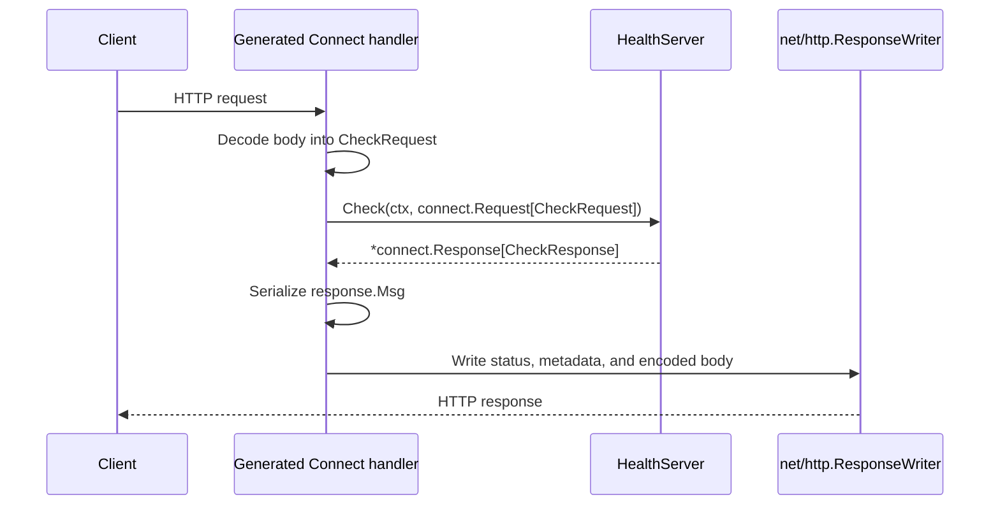

# Supplier RPC adapters

This package contains handwritten RPC implementations for `supplier-service`. The existing REST adapters remain under `internal/rest` during the migration.

Connect generates the HTTP handler, and a handwritten RPC method (for example, `HealthServer.Check`) runs when a matching RPC request reaches it. The generated handler decodes the request, calls the method, then encodes and sends the response.

The generated Connect handler can serve Connect, gRPC, and gRPC-Web clients.
All three protocols call the same methods in this package, so adding a gRPC
client does not require a separate handwritten server or `internal/grpc`
package. The HTTP server must still be configured to support the protocol used
by the client.

The server mounts one generated handler:

```go
path, handler := supplierv1connect.NewHealthServiceHandler(
    rpc.NewHealthServer(),
)
r.Mount(path, handler)
```

A generated Go client selects the protocol through its options:

```go
connectClient := supplierv1connect.NewHealthServiceClient(
    http.DefaultClient,
    baseURL,
)

grpcClient := supplierv1connect.NewHealthServiceClient(
    http.DefaultClient,
    baseURL,
    connect.WithGRPC(),
)

grpcWebClient := supplierv1connect.NewHealthServiceClient(
    http.DefaultClient,
    baseURL,
    connect.WithGRPCWeb(),
)
```

## Code ownership

The contract is defined in:

```text
proto/foc/supplier/v1/
```

Buf generates the corresponding Go code in:

```text
pkg/gen/foc/supplier/v1/
pkg/gen/foc/supplier/v1/supplierv1connect/
```

Do not edit generated files. Change the `.proto` source and run
`npm run buf:generate` from `frontend` instead.

Handwritten behavior belongs in this package:

```text
supplier-service/internal/rpc/
```

## Request flow

When the generated handler is mounted, a request follows this sequence:



The generated handler owns protocol routing, decoding, and encoding. The
handwritten method owns application behavior. `HealthServer.Check` returns typed
data and does not write to `http.ResponseWriter` directly.

## Protobuf and Connect responses

A protobuf response contains the operation's typed payload:

```go
&supplierv1.CheckResponse{
    Status: "ok",
}
```

A Connect response carries that payload through the Connect protocol:

```go
connect.NewResponse(&supplierv1.CheckResponse{
    Status: "ok",
})
```

The generated handler creates the Connect wrapper before calling the handwritten
method. The protobuf request is available through `req.Msg`:

```go
func (s *HealthServer) Check(
    ctx context.Context,
    req *connect.Request[supplierv1.CheckRequest],
) (*connect.Response[supplierv1.CheckResponse], error) {
    requestMessage := req.Msg
    requestHeaders := req.Header()

    _ = ctx
    _ = requestMessage
    _ = requestHeaders

    responseMessage := &supplierv1.CheckResponse{Status: "ok"}
    response := connect.NewResponse(responseMessage)
    response.Header().Set("Cache-Control", "no-store")

    return response, nil
}
```

In this example:

- `req.Msg` is the decoded `CheckRequest` protobuf message.
- `req.Header()` contains the incoming HTTP headers.
- `response.Msg` is the `CheckResponse` protobuf message.
- `response.Header()` and `response.Trailer()` contain protocol metadata.

The generated handler serializes `response.Msg` as the response body. Headers
and trailers are sent as HTTP metadata. The Connect wrapper itself is not
serialized as another object around the protobuf message.

## Server pattern

A handwritten server embeds the generated unimplemented handler:

```go
type HealthServer struct {
    supplierv1connect.UnimplementedHealthServiceHandler
}
```

An explicitly implemented method overrides its generated default. Methods added
to the contract but not yet implemented return Connect's `unimplemented` error.

The health server has no dependencies, so its constructor returns an empty
server:

```go
func NewHealthServer() *HealthServer {
    return &HealthServer{}
}
```

If health later needs application dependencies, receive the existing
`*deps.Env` through the constructor:

```go
type HealthServer struct {
    supplierv1connect.UnimplementedHealthServiceHandler
    env *deps.Env
}

func NewHealthServer(env *deps.Env) *HealthServer {
    return &HealthServer{env: env}
}
```

The router would create `HealthServer` once and pass the application
dependencies to it. Request methods would reuse those dependencies. They must
not create new database or Firebase clients for each request.

Every generated unary method receives a `context.Context`. Pass that same value
to database and network calls. For example, a future database readiness check
could pass the RPC context to the existing connection pool:

```go
func (s *HealthServer) checkDatabase(ctx context.Context) error {
    return s.env.Pool.Ping(ctx)
}
```

If the client disconnects or the RPC deadline expires, the context is canceled.
Passing `ctx` to `Ping` allows the database driver to stop the operation. Use
`http.NewRequestWithContext(ctx, ...)` when making an outbound HTTP request for
the same reason.

## REST coexistence

Do not call a REST adapter from an RPC adapter or an RPC adapter from a REST
adapter. When an operation contains nontrivial business logic, both adapters
should call the same shared operation:

```text
REST adapter ─────┐
                  ├→ shared operation
RPC adapter ──────┘
```

REST adapters continue to use the existing JSON envelope and HTTP errors. RPC
adapters return protobuf responses and Connect error codes.

## Adding an RPC

1. Change the appropriate `.proto` file.
2. Run `npm run buf:lint` from `frontend`.
3. Run `npm run buf:generate` from `frontend`.
4. Inspect, but do not edit, the generated interface.
5. Implement the generated method in this package.
6. Mount the generated handler in the supplier router.
7. Test through the generated client or an HTTP server, not only by calling the
   Go method directly.
