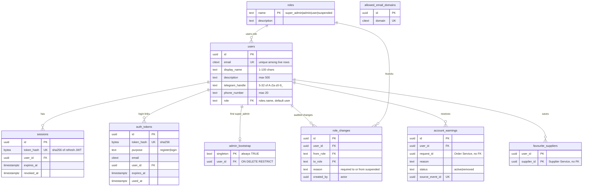
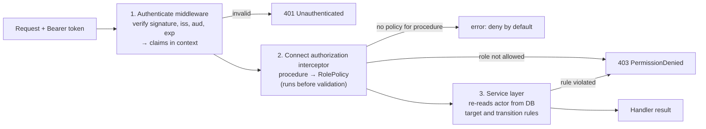

# User Service – Design

This document explains how the User Service defines roles, stores users,
authenticates them and enforces permissions for Friend on Campus (FoC). It is
the source for the project presentation. Update it, and the
[changelog](#7-changelog), whenever the design changes.

Status tags:

- **Merged**: on `main`.
- **In review**: in PR [#76](https://github.com/AY2627S1-CS3219-P1/FoC/pull/76)
  (profile and role administration RPCs) or
  [#106](https://github.com/AY2627S1-CS3219-P1/FoC/pull/106) (shared RBAC
  interceptor).
- **Planned**: designed, not implemented.

Related: [schema.md](schema.md) (full schema), [demo.md](demo.md) (demo runbook),
[REQUIREMENTS.md](../REQUIREMENTS.md) (backlog IDs such as U4).

## 1. Role design

**Merged** (roles and schema) · **In review** (enforcement)

FoC is a campus platform where students request food and other deliveries from
campus suppliers, and other students carry them. Each account has exactly one
role, seeded in `migrations/00003_roles.sql`:

| Role | Who | Problem it solves |
|---|---|---|
| `user` | Every registered student | One role acts as both **requester and courier** (U5). Splitting them would force two accounts or role switching for something students do interchangeably. |
| `suspended` | A user an admin has suspended | Removes a misbehaving user's ability to act (create or accept requests, review, submit suppliers) while keeping read access to their history, reports and appeals (U6). A role rather than a status flag means one field decides what a user can do, so a "suspended admin" cannot exist. |
| `admin` | Moderators | Handles day-to-day moderation, such as suspending and reinstating users and managing Locations, without the power to create more admins. |
| `super_admin` | The operator-bootstrapped owner | The only role that can grant or revoke `admin`. Keeping privilege escalation with one account limits the damage a compromised moderator account can do. |

In JWTs the suspended role is written `suspended_user`
(`internal/jwt/tokenclaims/claims.go`); `pkg/authorization` converts it to the
canonical `suspended`.

### Capability matrix

✅ allowed · ❌ denied · "own" = only the caller's own record.

| Service | Action | `super_admin` | `admin` | `user` | `suspended` |
|---|---|:-:|:-:|:-:|:-:|
| User | Request link, log in, refresh, log out | ✅ | ✅ | ✅ | ✅ |
| User | `ProfileService.GetMyProfile` | own | own | own | own |
| User | `ProfileService.UpdateMyProfile` | own | own | own | ❌ |
| User | `UserAdminService.GetUserByEmail` | ✅ | ✅ | ❌ | ❌ |
| User | `ChangeUserRole`: `user` ↔ `suspended` | ✅ | ✅ | ❌ | ❌ |
| User | `ChangeUserRole`: grant or revoke `admin` | ✅ | ❌ | ❌ | ❌ |
| User | `ChangeUserRole` on self or on a `super_admin` | ❌ | ❌ | ❌ | ❌ |
| Supplier | `LocationDiscoveryService` (active Locations, buildings, categories) | ✅ | ✅ | ✅ | ✅ |
| Supplier | `ListLocations` with archived or all status view | ✅ | ✅ | ❌ | ❌ |
| Supplier | `LocationAdminService` (create, update, archive, unarchive) | ✅ | ✅ | ❌ | ❌ |
| Supplier | Submit a Location addition request (U6.6) | *Planned* | | ✅ | ❌ |
| Order | Create, accept, review requests (U6.3–U6.5) | *Planned* | | ✅ | ❌ |

Suspended users can still sign in, because U6.7 and U6.8 require them to keep
access to order history, reports and appeals.

## 2. Database choice and schema

**Merged**

### Why PostgreSQL 18

| FoC need | How PostgreSQL meets it |
|---|---|
| User data is relational: users → sessions, tokens, role history, warnings | Foreign keys and `ON DELETE` rules keep references valid. |
| Business rules must hold even if a code path forgets them | `CHECK` constraints: Telegram handle format, display name length, a reason is required for suspension, a warning is `removed` exactly when `removed_at` is set. |
| Emails are case-insensitive and accounts are soft-deleted | `citext` columns with **partial** unique indexes (`WHERE deleted_at IS NULL`) let a deleted address register again. |
| A role change and its audit record must commit together | ACID transactions (`store.Admin.ChangeRole`). |
| Bootstrap must be safe with several instances starting at once | `LOCK TABLE admin_bootstrap IN EXCLUSIVE MODE` plus a singleton primary key. |
| Idempotent consumption of events from other services | `UNIQUE (source_event_id)` with `ON CONFLICT DO NOTHING`. |

**Query patterns** are point lookups by email (magic-link request), by ID
(login, refresh, profile) and live sessions per user (logout of all devices).
Each has an index: `idx_users_email_live`, the primary key, and
`idx_sessions_user_live`. Admin listing filters by `idx_users_role`.

**Scalability:** other services never query this database. They verify access
tokens locally with the published public key (see
[§3](#3-authentication-and-authorization)). The User Service handles only
sign-in, refresh and profile or role writes, which are low-volume
compared with request traffic. The service itself is stateless apart from
PostgreSQL, so it scales horizontally. The data belongs to this service
alone: other services refer to users by UUID, with no cross-database foreign keys.

### Schema

The schema comes from the goose migrations in `migrations/`; GORM models in
`internal/models` mirror it. Every table with an `id` also has `created_at`,
`updated_at`, `deleted_at` (soft delete), `created_by` and `updated_by`
(the acting user, `NULL` = system). These are omitted below.



| Table | Purpose |
|---|---|
| `users` | Profile and current role. |
| `roles` | Lookup table; the FK stops an unknown role from being stored. |
| `admin_bootstrap` | Single row recording the first `super_admin`. |
| `role_changes` | Append-only audit trail of every role change, with actor and reason. |
| `allowed_email_domains` | Registration whitelist. An empty table rejects every registration. |
| `auth_tokens` | Pending magic links (hashes only). |
| `sessions` | One row per signed-in device, holding the refresh token's hash. |
| `account_warnings` | Warnings raised by the Order and Report services (U7). |
| `favourite_suppliers` | A user's saved suppliers (U3.4). |

Constraints, soft-delete behaviour and key queries: [schema.md](schema.md).

### Credential storage

FoC has **no passwords**. A user proves they own their university email by
clicking a magic link, so there is no password database to leak.

| Credential | Storage and handling |
|---|---|
| Magic-link token | 32 random bytes (`crypto/rand`), base64url in the emailed link. Only its SHA-256 is stored (`auth_tokens.token_hash`). Expires after 10 minutes. It is consumed atomically once by `UPDATE … SET used_at = now() WHERE used_at IS NULL AND expires_at > now() RETURNING *`, so a replayed or expired link matches no row. Issuing a new link does not invalidate older ones (U2.1.7). |
| Refresh token | ES256 JWT with no role claim. Only its SHA-256 is stored in `sessions.token_hash`. Sent to the browser as the `foc-refresh-token` cookie: `HttpOnly`, `Secure`, `SameSite=Strict`, `Path=/user.v1.AuthService/`, so scripts cannot read it and it is sent to the auth RPCs only. Each refresh revokes the old session and creates a new one (rotation). |
| Access token | ES256 JWT held in browser memory, never stored server-side. Lifetime is `JWT_ACCESS_TOKEN_TTL` (default 10 min). |
| Signing key | P-256 private key in a PKCS#8 file (`JWT_PRIVATE_KEY_FILE`), outside the database and the repository (`.local/secrets`). Only the public key is published. |

A database leak therefore exposes no usable token: the hashes cannot be
reversed, and the JWT signing key is not in the database.

## 3. Authentication and authorization

### Authentication: magic link + JWT

**Merged**

```mermaid
sequenceDiagram
    actor U as Browser
    participant A as User Service (AuthService)
    participant DB as PostgreSQL
    participant M as SMTP (Mailpit locally)

    U->>A: RequestLink(email)
    A->>DB: find user; if new, check allowed_email_domains
    A->>DB: insert auth_tokens(sha256(token), purpose, expires +10m)
    A->>M: email /login?token=… or /register?token=…
    U->>A: Login(token) or Register(token, display_name)
    A->>DB: consume token (single-use UPDATE … RETURNING)
    A->>DB: insert sessions(sha256(refresh JWT))
    A-->>U: access JWT (body) + refresh cookie
    Note over U,A: access token expires after 10 min
    U->>A: Refresh (cookie)
    A->>DB: reload user role, revoke old session, create new one
    A-->>U: new access JWT (current role) + new cookie
    U->>A: Logout / LogoutAll (cookie)
    A->>DB: revoke this session / every session of the user
```

The access-token claims come from `internal/jwt/tokenclaims/claims.go`:

| Claim | Value |
|---|---|
| `iss` / `aud` | `foc-user-service` / `foc-services` |
| `sub` | User UUID |
| `sid` | Session UUID |
| `role` | `super_admin`, `admin`, `user` or `suspended_user` |
| `token_use` | `access` (refresh tokens use `refresh` and carry no role) |
| `iat`, `nbf`, `exp`, `jti` | Required; `nbf` must equal `iat` |

The auth RPCs also reject a browser `Origin` other than the configured
frontend (`internal/middleware/origin.go`). Calls from other services have no
`Origin` header and are allowed.

### Why token-based rather than a third-party identity provider

- **Campus-only sign-up:** registration requires a whitelisted email domain,
  and the magic link proves the student owns the mailbox. A third-party provider
  would still need this check.
- **Services verify tokens on their own:** each service fetches the public key
  once through `user.v1.PublicKeyService/GetPublicKeys` and verifies ES256
  signatures locally, so a request never waits on a call to the User Service.
- **No shared secret:** ES256 is asymmetric, so a compromised downstream
  service cannot mint tokens.

### Authorization: three layers

**In review (#106, #76)**



1. **Authentication middleware.** The User Service uses
   `AuthenticateLocal` (`pkg/middleware/local.go`), which verifies tokens with its
   own key; other services use `Authenticator.Authenticate`
   (`pkg/middleware/authenticator.go`). A missing or invalid token gets
   `Unauthenticated`. Valid claims are stored in the request context under
   `authorization.ClaimsKey`.
2. **Per-procedure role policy.**
   `authorization.NewConnectInterceptor(policies)` (`pkg/authorization`) looks
   up the procedure in a map set in `internal/router/router.go`:

   | Procedure | Policy |
   |---|---|
   | `ProfileService/GetMyProfile` | all four roles |
   | `ProfileService/UpdateMyProfile` | `user`, `admin`, `super_admin` |
   | `UserAdminService/GetUserByEmail`, `ChangeUserRole` | `admin`, `super_admin` |

   A procedure missing from the map is denied, so a new RPC cannot be
   exposed by accident. The interceptor runs before request validation, so
   unauthorized callers learn nothing about the request format.
3. **Service-layer checks against the database.** Coarse role checks are not enough for
   rules that depend on the target or on current state. `RoleService.ChangeUserRole`
   (`internal/service/roles.go`) locks and re-reads the **actor** from the
   database (`GetByIDForUpdate`), then applies the target and transition rules
   in [§6](#6-role-lifecycle-and-administration). `ProfileService.UpdateMyProfile`
   re-reads the user's current role.

**Why this approach suits FoC**

- Most checks need only the token's role claim (layer 2), so they cost no
  database call. That covers every Supplier and future Order read.
- The few privileged writes (role changes, profile updates) re-check the
  database (layer 3), so an out-of-date role in a token cannot grant
  more power than the account currently has.
- Policies are data (a map from procedure to allowed roles) in a shared package, so
  each service states its own rules and uses the same enforcement code.

**Known limit:** an access token keeps its role until it expires (≤ 10
minutes). A demoted or suspended user keeps token-based permissions in *other*
services until they refresh or the token expires. The User Service's own
privileged writes are not affected because of layer 3. Tracked in
[#57](https://github.com/AY2627S1-CS3219-P1/FoC/issues/57); NFR-05.4.1
requires 1 minute.

## 4. Integration with the Supplier Service

**Merged**

The Supplier Service imports `user-service/pkg/middleware` and uses the
User Service only as the issuer of trusted tokens:

```mermaid
sequenceDiagram
    participant S as Supplier Service
    participant US as User Service
    actor C as Client
    S->>US: startup: PublicKeyService/GetPublicKeys
    US-->>S: JWKS (ES256 P-256 public key)
    Note over S: cache 1 h; refetch early on unknown kid (rate-limited to once per 5 s)
    C->>S: LocationAdminService/CreateLocation + Bearer token
    S->>S: Authenticate: verify signature, iss, aud, exp
    S->>S: AdminAuthorizationInterceptor: role ∈ {admin, super_admin}?
    S->>S: location.requireAdmin (domain check)
    S-->>C: 200 / 401 / 403
```

| Layer | Code |
|---|---|
| Authentication on every Location RPC | `supplier-service/internal/router/router.go`: `authenticator.Authenticate(locationHandler)` and `authenticator.Authenticate(adminHandler)` |
| Caller from claims | `internal/rpc/location.go:callerFromContext`: `Admin = role == "admin" \|\| role == "super_admin"` |
| RPC-wide admin gate, before validation | `internal/rpc/location_admin.go:AdminAuthorizationInterceptor` |
| Domain check | `internal/location/admin.go:requireAdmin`; `location.go` rejects archived or all status views for non-admins |

The Supplier Service never calls the User Service per request. If the User
Service is down, tokens keep working until the cached keys expire.
[demo.md](demo.md) steps 6–7 show that a `user` token gets `PermissionDenied`
from `LocationAdminService` and a restricted `ListLocations` view, while an
`admin` token succeeds.

## 5. User profile management

**In review (#76)**

`ProfileService` has two RPCs: `GetMyProfile` and `UpdateMyProfile`.

**Protected fields cannot be addressed.** `UpdateMyProfileRequest`
(`proto/user/v1/profile.proto`) contains only `display_name`, `description`,
`telegram_handle` and `phone_number`. There is no field for user ID, email,
role or account status:

- The target user is always the token's `sub`, never a request field, so a
  user cannot edit someone else's profile.
- Fields outside the contract are never decoded into the request, and the
  store writes an explicit field list (`store.Users.UpdateActiveProfile`), so
  `role` or `id` cannot be mass-assigned.
- Role changes happen only through `UserAdminService.ChangeUserRole`, which
  has its own policy and audit trail.

**Validation at three levels:**

| Level | Checks |
|---|---|
| Contract (`buf.validate`) | `description` ≤ 500 characters |
| Service (`internal/service/profile.go`) | Trims values. Display name must be 1–100 characters. Telegram handle must match `^[A-Za-z0-9_]{5,32}$` (no `@`). Phone number ≤ 20 characters. A blank contact field clears it. |
| Database | The same limits as `CHECK` constraints on `users`, in case a code path skips the service |

**Suspended users** can read their profile but not update it. The interceptor
denies `suspended` tokens. In addition, `UpdateActiveProfile` updates only
`WHERE id = ? AND role <> 'suspended'`, which closes the gap
where a user is suspended while still holding a `user` token. Every write sets
`updated_by` to the actor.

## 6. Role lifecycle and administration

### First administrator

**Merged**

There is no "sign up as admin" endpoint. The operator sets
`BOOTSTRAP_SUPERADMIN_EMAIL` (and optionally
`BOOTSTRAP_SUPERADMIN_DISPLAY_NAME`) before starting the service. After
migrations, `bootstrap.Bootstrapper.Run` → `store.Admin.Bootstrap` runs in
**one transaction**:

1. `LOCK TABLE admin_bootstrap IN EXCLUSIVE MODE` serialises concurrent
   instances.
2. If an `admin_bootstrap` row exists, it does nothing and returns `already_done`.
3. Otherwise it creates the user as `super_admin`, or promotes an existing user
   with that email and records a `role_changes` row ("admin bootstrap").
4. It inserts the singleton row. Its primary key is `singleton BOOLEAN CHECK (singleton)`,
   so a second row cannot exist.

How this is secured:

- Only someone who controls the deployment configuration can create the first
  admin. No HTTP endpoint exists for it.
- It runs **once**: after the row exists, later runs ignore the variables, even if
  the email changes. Changing configuration later cannot take over an existing
  system.
- An invalid email or display name stops startup instead of failing
  silently.
- The admin still signs in with the normal magic link, so they must own the
  mailbox. Only the domain whitelist is skipped.

### Promotion workflow (no developer involvement)

**In review (#76)**

```mermaid
sequenceDiagram
    actor S as super_admin
    participant US as User Service
    participant DB as PostgreSQL
    actor B as Bob (user)
    B->>US: registers via magic link (role = user)
    S->>US: UserAdminService/GetUserByEmail(bob@u.nus.edu)
    US-->>S: UserSummary{id, role: user}
    S->>US: ChangeUserRole(id, ADMIN, reason)
    US->>DB: BEGIN; lock actor row; verify actor is super_admin
    US->>DB: UPDATE users SET role='admin' WHERE id=? AND role='user'
    US->>DB: INSERT role_changes(from user, to admin, created_by=actor)
    US->>DB: COMMIT
    B->>US: Refresh
    US-->>B: access token with role=admin
```

- `admin` can **suspend and reinstate** users (`user` ↔ `suspended`). A reason is
  required, enforced by the service and by a `CHECK` on `role_changes`.
- Only `super_admin` can **grant or revoke `admin`**.
- Every change is recorded in `role_changes` with the actor (`created_by`),
  the reason, and optionally the originating report (`report_id`).
- The admin RPCs return a `UserSummary` without contact details, so moderators
  do not see Telegram handles or phone numbers (NFR-06.6).

### Transition rules (`internal/service/roles.go`)

| Actor | Target's current role | Allowed new roles |
|---|---|---|
| `super_admin` | `admin`, `user`, `suspended` | any other of `admin`, `user`, `suspended` |
| `admin` | `user`, `suspended` | the other of `user`, `suspended` |
| anyone | `super_admin` | none |
| anyone | self | none |

`super_admin` can never be the new role: only the bootstrap assigns it.

### Edge cases

| Scenario | Result | Enforced by |
|---|---|---|
| An admin tries to revoke their own privileges | `PermissionDenied` | `actorID == targetID` check in `ChangeUserRole` |
| The only administrator tries to demote themselves | `PermissionDenied`. The bootstrap `super_admin` cannot be demoted by anyone, including themselves, so the system always keeps one super admin. | self check plus "target is `super_admin`" check |
| Deleting the bootstrap administrator | Refused | `store.Users.Delete` returns `ErrInUse`, and `admin_bootstrap.user_id` is `ON DELETE RESTRICT` |
| An admin tries to promote someone to `admin`, or demote another admin | `PermissionDenied` | actor or target rules |
| Two admins change the same user at once | The second gets `Aborted` | optimistic `WHERE role = <from>` in `store.Admin.ChangeRole` |
| An admin demoted a moment ago uses their still-valid token | `PermissionDenied` | the actor's current role is re-read from the database with a lock |
| Suspending or reinstating without a reason | `InvalidArgument` | service check plus `role_changes` `CHECK` |
| Changing a role to the one the user already has | `FailedPrecondition` | `ErrRoleUnchanged` plus `CHECK (from_role <> to_role)` |
| Setting `BOOTSTRAP_SUPERADMIN_EMAIL` to a new address later | Ignored and logged | `admin_bootstrap` row already exists |

### Gaps and planned work

- **Account deletion:** `store.Users.Delete` exists (soft delete, revokes
  sessions, refuses the bootstrap admin), but it has no RPC yet.
- **Domain whitelist administration:** managed with SQL until an admin RPC
  exists.
- **Transferring super admin:** not supported. Deleting the `admin_bootstrap`
  row by hand re-arms the bootstrap. This is a deliberate, operator-only
  recovery step.
- **Prompt token revocation** after suspension or demotion:
  [#57](https://github.com/AY2627S1-CS3219-P1/FoC/issues/57).
- **Enforcement of suspension in the Order Service and in Supplier
  addition requests** (U6.3–U6.6): rules set by the owning services, using the
  `role` claim.

## 7. Changelog

| Date | Change |
|---|---|
| 2026-10-01 | First version: roles, schema, magic-link authentication, three-layer RBAC (#76, #106 in review), Supplier integration, bootstrap and role lifecycle. |
