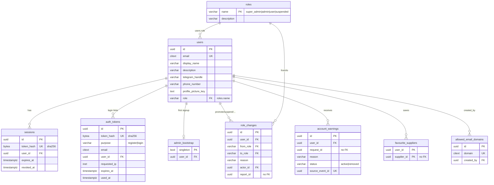

# User Service – Database Schema

PostgreSQL 16. Source of truth: `migrations/*.sql` (goose). GORM entities: `internal/models`.



## Tables

| Migration | Table | Backlog | Notes |
|---|---|---|---|
| 00001 | `users` | U1, U3 | `citext` email = case-insensitive unique |
| 00002 | `allowed_email_domains` | U1.1.2 | empty table = no restriction |
| 00002 | `auth_tokens` | U1.2, U2.1 | hash only; atomic consume (below); `requested_ip` used for rate limiting |
| 00002 | `sessions` | U2.2, NFR-05.4 | opaque token hash; `revoked_at` for logout / logout-all |
| 00003 | `roles` + `users.role` | U4, U5, U6 | one role per user; suspension is a role, so there's no status column |
| 00003 | `admin_bootstrap` | U4.2 | singleton row; first signup wins it and becomes `super_admin` |
| 00004 | `role_changes` | U4, U6 | append-only history; reason required when suspending/reinstating |
| 00004 | `account_warnings` | U7 | `source_event_id` unique = idempotent; removed ⇔ `removed_at` set |
| 00005 | `favourite_suppliers` | U3.4 | `supplier_id` has no FK (other service) |

## Key queries

```sql
-- Consume magic link (0 rows => invalid / expired / used)
UPDATE auth_tokens SET used_at = $now
WHERE token_hash = $1 AND purpose = $2 AND used_at IS NULL AND expires_at > $now
RETURNING *;

-- First signup (same tx as user insert): 1 row => set role = 'super_admin'
INSERT INTO admin_bootstrap (user_id) VALUES ($1) ON CONFLICT DO NOTHING;

-- Change role (same tx), optimistic on current role
UPDATE users SET role = $to, updated_at = now() WHERE id = $1 AND role = $from;
INSERT INTO role_changes (user_id, from_role, to_role, reason, actor_id) VALUES (...);

-- Logout all devices
UPDATE sessions SET revoked_at = now() WHERE user_id = $1 AND revoked_at IS NULL;

-- Idempotent warning from an event
INSERT INTO account_warnings (...) VALUES (...) ON CONFLICT (source_event_id) DO NOTHING;
```

## Roles & authorisation

No permissions table. Each handler reads the caller's role (`auth.Require`)
and decides. Shared rules live in `internal/auth`:

| Caller | Can manage (`CanManage`) | Role changes (`CanAssignRole`) |
|---|---|---|
| `super_admin` | `admin`, `user`, `suspended` | anything among those three, incl. promote user → admin, demote admin |
| `admin` | `user`, `suspended` | user ↔ suspended (suspend / reinstate) |
| `user` | – | – |
| `suspended` | – | – |

Nobody can change their own role. `super_admin` is only granted by first-signup bootstrap.

## Conventions

- Migrations use goose: one `0000N_name.sql` per change with `-- +goose Up` / `-- +goose Down`. Never edit an applied migration.
- Cross-service IDs (`supplier_id`, `request_id`, `report_id`, `appeal_id`) are plain UUIDs, no FK.
- Tokens are never stored raw, only `sha256`.
