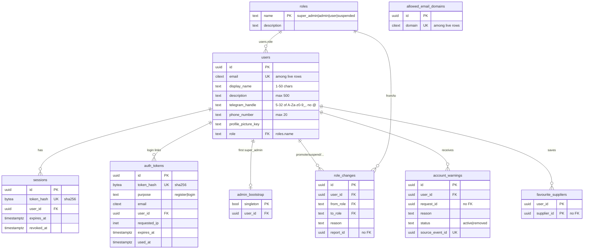

# User Service – Database Schema

PostgreSQL 18. Source of truth: `migrations/*.sql` (goose). GORM entities: `internal/models`.

Every table with a single `id` embeds `models.BaseModel` plus userstamps:
`id UUID`, `created_at`, `updated_at`, `deleted_at` (soft delete),
`created_by` and `updated_by` (FK to `users.id`, `NULL` = system). The diagram
leaves these columns out.


```mermaid
erDiagram
    roles ||--o{ users : "users.role"
    users ||--o{ sessions : has
    users ||--o{ auth_tokens : "login links"
    users ||--o| admin_bootstrap : "first super_admin"
    users ||--o{ role_changes : "promote/suspend/..."
    roles ||--o{ role_changes : "from/to"
    users ||--o{ account_warnings : receives
    users ||--o{ favourite_suppliers : saves

    users {
        uuid id PK
        citext email UK "among live rows"
        text display_name "1-50 chars"
        text description "max 500"
        text telegram_handle "5-32 of A-Za-z0-9_, no @"
        text phone_number "max 20"
        text profile_picture_key
        text role FK "roles.name"
    }
    roles {
        text name PK "super_admin|admin|user|suspended"
        text description
    }
    admin_bootstrap {
        bool singleton PK
        uuid user_id FK
    }
    allowed_email_domains {
        uuid id PK
        citext domain UK "among live rows"
    }
    auth_tokens {
        uuid id PK
        bytea token_hash UK "sha256"
        text purpose "register|login"
        citext email
        uuid user_id FK
        inet requested_ip
        timestamptz expires_at
        timestamptz used_at
    }
    sessions {
        uuid id PK
        bytea token_hash UK "sha256"
        uuid user_id FK
        timestamptz expires_at
        timestamptz revoked_at
    }
    role_changes {
        uuid id PK
        uuid user_id FK
        text from_role FK
        text to_role FK
        text reason
        uuid report_id "no FK"
    }
    account_warnings {
        uuid id PK
        uuid user_id FK
        uuid request_id "no FK"
        text reason
        text status "active|removed"
        uuid source_event_id UK
    }
    favourite_suppliers {
        uuid user_id PK
        uuid supplier_id PK "no FK"
    }
```

## Tables

| Migration | Table | Backlog | Notes |
|---|---|---|---|
| 00001 | `users` | U1, U3 | `citext` email = case-insensitive unique |
| 00002 | `allowed_email_domains` | U1.1.2 | empty table = no restriction |
| 00002 | `auth_tokens` | U1.2, U2.1 | hash only; atomic consume (below); `requested_ip` used for rate limiting |
| 00002 | `sessions` | U2.2, NFR-05.4 | opaque token hash; `revoked_at` for logout / logout-all |
| 00003 | `roles` + `users.role` | U4, U5, U6 | one role per user; suspension is a role, so there's no status column |
| 00003 | `admin_bootstrap` | U4.2 | singleton row; written once by the startup bootstrap (`BOOTSTRAP_SUPERADMIN_EMAIL`), whose user becomes `super_admin` |
| 00004 | `role_changes` | U4, U6 | append-only history; reason required when suspending/reinstating |
| 00004 | `account_warnings` | U7 | `source_event_id` unique = idempotent; removed ⇔ `removed_at` set |
| 00005 | `favourite_suppliers` | U3.4 | `supplier_id` has no FK (other service) |

## Soft delete

GORM adds `deleted_at IS NULL` to every query on a model with `BaseModel`,
and `Delete` only sets `deleted_at`. So database `ON DELETE CASCADE` fires only
for `Unscoped()` (hard) deletes. `store.Users.Delete` cascades in the
application instead: it soft-deletes the user's sessions and auth tokens and
removes their favourites. Warnings and role changes stay as history. A user
still referenced by `admin_bootstrap` cannot be deleted.

`users.email` and `allowed_email_domains.domain` are unique only among rows
that are not soft-deleted. `account_warnings.source_event_id` stays unique
across all rows so event replays remain idempotent. `role_changes.created_by`
is the actor who made the change.

## Key queries

```sql
-- Consume magic link (0 rows => invalid / expired / used)
UPDATE auth_tokens SET used_at = $now, updated_at = $now
WHERE token_hash = $1 AND purpose = $2 AND used_at IS NULL AND expires_at > $now
  AND deleted_at IS NULL
RETURNING *;

-- Admin bootstrap (one tx): serialise instances, then no-op if already done;
-- otherwise create or promote the user to 'super_admin' and claim the row
LOCK TABLE admin_bootstrap IN EXCLUSIVE MODE;
SELECT count(*) FROM admin_bootstrap;
INSERT INTO admin_bootstrap (user_id) VALUES ($1);

-- Change role (same tx), optimistic on current role
UPDATE users SET role = $to, updated_at = now() WHERE id = $1 AND role = $from AND deleted_at IS NULL;
INSERT INTO role_changes (user_id, from_role, to_role, reason, created_by) VALUES (...);

-- Logout all devices
UPDATE sessions SET revoked_at = now() WHERE user_id = $1 AND revoked_at IS NULL AND deleted_at IS NULL;

-- Idempotent warning from an event
INSERT INTO account_warnings (...) VALUES (...) ON CONFLICT (source_event_id) DO NOTHING;
```

## Roles & authorisation (planned)

No permissions table. Each handler reads the caller's role (`auth.Require`)
and decides. Shared rules live in `internal/auth`:

| Caller | Can manage (`CanManage`) | Role changes (`CanAssignRole`) |
|---|---|---|
| `super_admin` | `admin`, `user`, `suspended` | anything among those three, incl. promote user → admin, demote admin |
| `admin` | `user`, `suspended` | user ↔ suspended (suspend / reinstate) |
| `user` | – | – |
| `suspended` | – | – |

Nobody can change their own role. `super_admin` is only granted by the startup admin bootstrap.

## Conventions

- Migrations use goose: one `0000N_name.sql` per change with `-- +goose Up` / `-- +goose Down`. Never edit an applied migration.
- Text columns are `TEXT`; length and format limits are `CHECK` constraints.
- Cross-service IDs (`supplier_id`, `request_id`, `report_id`, `appeal_id`) are plain UUIDs, no FK.
- Tokens are never stored raw, only `sha256`.
